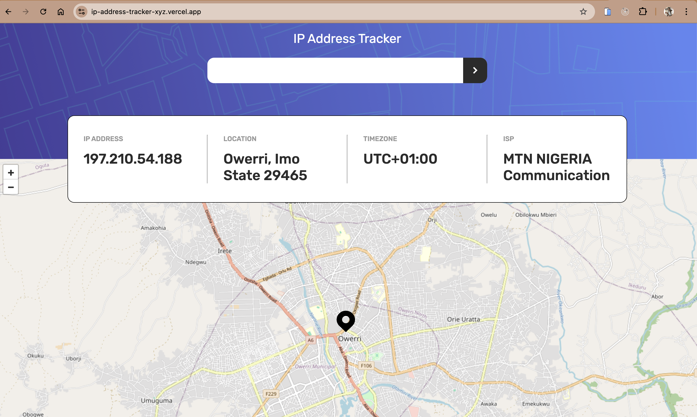

# IP address tracker

This is my solution to the [IP address tracker challenge on Frontend Mentor](https://www.frontendmentor.io/challenges/ip-address-tracker-I8-0yYAH0). Frontend Mentor challenges help you improve your coding skills by building realistic projects. 

## Table of contents

- [Overview](#overview)
  - [The challenge](#the-challenge)
  - [Screenshot](#screenshot)
  - [Links](#links)
- [My process](#my-process)
  - [Built with](#built-with)
  - [Installation](#installation)
    - [Prerequisites](#prerequisites)
    - [Steps](#steps)

## Overview

### The challenge

Key features of the app:

- The layout adjusts to provide an optimal experience across different screen sizes
- Interactive elements on the page have hover states for a smooth user experience
- The user's IP address is displayed on the map when the page loads
- Users can search for any IP addresses or domains and see the key information and location

### Screenshot



### Links

- Live Site URL: [IP address tracker](https://ip-address-tracker-xyz.vercel.app/)

## My process

I created a custom `useFetch` hook that simplifies API requests using Axios, managing load states, handling errors, and aborting the request when necessary.

### Built with

- Modular CSS - For styling
- [Axios](https://axios-http.com/) - For data fetching
- [React Leaflet](https://react-leaflet.js.org/) - For the map
- [React](https://reactjs.org/) - JS library
- [Typescript](https://www.typescriptlang.org/docs/handbook/react.html)
- [Zod](https://zod.dev/) - For request validation

### Installation

#### Prerequisites

- Node.js (v16 or later)
- npm
- [IP Geolocation API by IPify](https://geo.ipify.org/) account

⚠️ **IMPORTANT** ⚠️: To use the IP Geolocation API by IPify, you'll need to sign up for a free account. You won't need to add any cards details to do this and it's a very quick process. This will generate an API Key for you. Usually, you would be able to restrict your API Key to a specific URL (your own domain). This makes sure that other people can't use your API Key on their own websites. IPify doesn't have this feature, but because you aren't adding your card details, this isn't an issue. **So be sure to only sign up for the free account and DO NOT enter any card details**.

#### Steps
1. Clone the repository
```sh
  git clone https://github.com/CrownedTechie/ip-address-tracker.git
```

2. Install Dependencies
```sh
  npm install 
```

3. Setup your Environment Variables: 
Create a `.env` file and add:
```#.env
  VITE_API_KEY=your-IPify-API-key
```

4. Run the Development Server
```sh
  npm run dev
```

5. Build for Production
```sh
  npm run build
```

***
Made with ❤️ and ☕ by Crownedtechie 
Gmail - [nenchi00@gmail.com](mailto:nenchi00@gmail.com)
